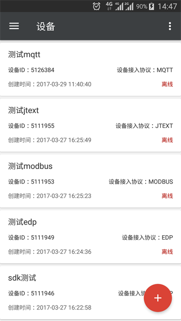
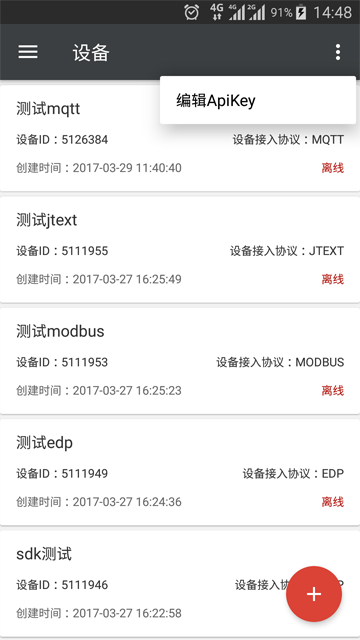
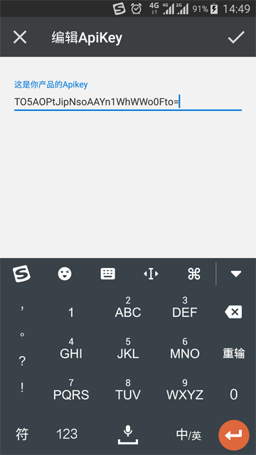
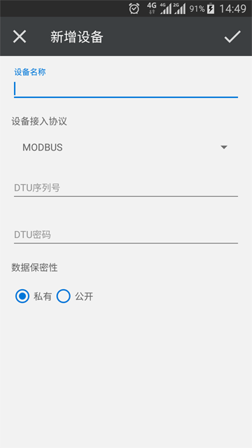
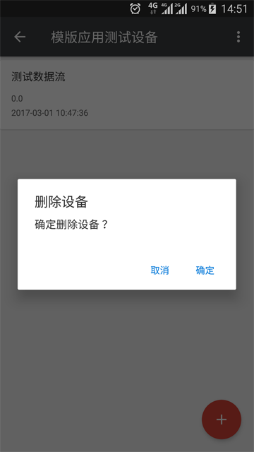
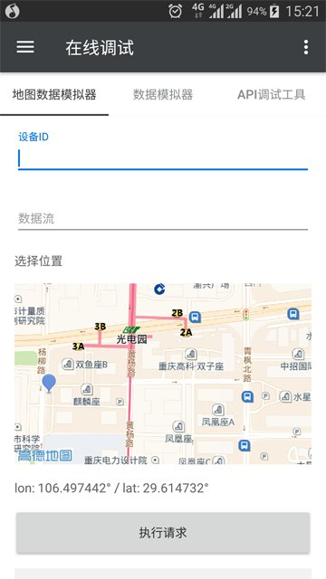
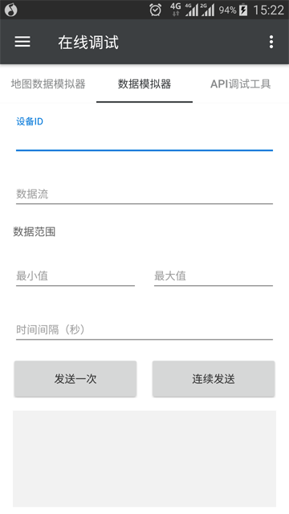
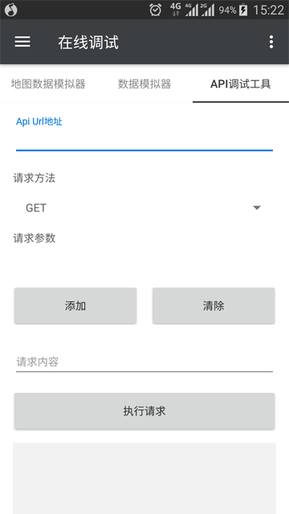

# OneNET RESTful SDK for Android

[  ](https://bintray.com/darren/maven/onenet-sdk/_latestVersion)
[]()


本项目是 **中移物联网公司** 为方便Android开发者接入 **OneNET** 平台而开发的客户端SDK。关于设备云请进入[**OneNET主站**](http://open.iot.10086.cn)了解详情。

## 系统要求

- SDK运行要求：Android 1.6 (API 4) 及以上
- Sample运行要求：Android 4.1 (API 16) 及以上

## 使用方法

```gradle
dependencies {
    compile 'com.chinamobile.iot.onenet:onenet-sdk:2.1.1'
}
```

详细说明**请参考[wiki文档](https://github.com/cm-heclouds/AndroidSDK/wiki)**

## 示例

v2.0版本提供了更加美观和丰富的示例App供开发者参考，遵循Google Material Design风格，完全开源，开发者可以Clone项目源码查看详细内容。

也可以在此[**下载安装包**](OneNET_SDK-Sample.apk)

 
 
 
 
 

## 使用的第三方库

### SDK

- [OkHttp](https://github.com/square/okhttp)

### Sample App

- Android AppCompat v7
- Android Design Support Library
- Android CardView v7
- Android RecyclerView v7
- [Gson](https://github.com/google/gson)
- [BaseRecyclerViewAdapterHelper](https://github.com/CymChad/BaseRecyclerViewAdapterHelper)
- [FloatingActionButton](https://github.com/Clans/FloatingActionButton)

## 说明

- v2.0版本完全重写了SDK，传输层使用[OkHttp3](https://github.com/square/okhttp)，API根据[OneNET RESTful文档](http://www.heclouds.com/doc/art262.html#68)做了相应的增减，API与v1.x不兼容，请使用了v1.x版本的开发者慎重升级。
- 更新到v2.x的开发者，如果要查看v1.x的代码，只要`git checkout OneNETSDK-v1`即可，或[在此查看](https://github.com/cm-heclouds/AndroidSDK/tree/OneNETSDK-v1)。

## 反馈及意见

SDK使用过程中遇到的任何问题，都可以通过Issues来反馈，请尽可能的描述清楚遇到的问题，如果有错误信息也一同附带，并且在 Labels 中指明类型为 bug 或者其他，我们会以最快的速度给予解决。

[通过这里查看已有的 issues 和提交 Bug](https://github.com/cm-heclouds/AndroidSDK/issues)

## License

The MIT License (MIT)

    Copyright (c) 2015-2017 China Mobile IOT

    Permission is hereby granted, free of charge, to any person obtaining a copy
    of this software and associated documentation files (the "Software"), to deal
    in the Software without restriction, including without limitation the rights
    to use, copy, modify, merge, publish, distribute, sublicense, and/or sell
    copies of the Software, and to permit persons to whom the Software is
    furnished to do so, subject to the following conditions:

    The above copyright notice and this permission notice shall be included in all
    copies or substantial portions of the Software.

    THE SOFTWARE IS PROVIDED "AS IS", WITHOUT WARRANTY OF ANY KIND, EXPRESS OR
    IMPLIED, INCLUDING BUT NOT LIMITED TO THE WARRANTIES OF MERCHANTABILITY,
    FITNESS FOR A PARTICULAR PURPOSE AND NONINFRINGEMENT. IN NO EVENT SHALL THE
    AUTHORS OR COPYRIGHT HOLDERS BE LIABLE FOR ANY CLAIM, DAMAGES OR OTHER
    LIABILITY, WHETHER IN AN ACTION OF CONTRACT, TORT OR OTHERWISE, ARISING FROM,
    OUT OF OR IN CONNECTION WITH THE SOFTWARE OR THE USE OR OTHER DEALINGS IN THE
    SOFTWARE.
