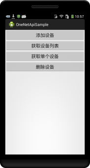
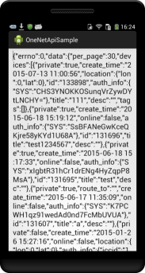

# SDK for Android #

本项目是 **中移物联网公司** 为方便Android开发者接入 **设备云** 平台而开发的SDK。关于设备云请进入[**设备云主站**](http://open.iot.10086.cn)了解详情。如果要了解OneNet API请进入 [**开发者中心**](http://open.iot.10086.cn/develop) 参考**API文档**。

## 屏幕截图 ##




## 说明 ##

- 将 **onenetapi-library** 导入为 Android library，并将你的主工程依赖于 **onenetapi-library**
- 你也可以将编译好的 **jar** 文件拷贝到工程的 **libs** 目录下或者将 **onenetapi-library** 的源码拷贝到工程的 **src** 目录下
- 如果不想自己编译，也可以直接下载对应的二进制库文件[**onenetapi-library-release.jar**](https://github.com/cm-heclouds/AndroidSDK/releases)


## 如何使用 ##

### 示例 ###

所有的请求都是通过`com.chinamobile.iot.onenet.OneNetApi.java`完成，以获取设备列表为例

```java
	String apiKey = "xxxxxxxxxxx-xxxxxxxxxxxxxx-xxxxxxxxxxxx";

	OneNetApi.getInstance(context).getDevices(apiKey, null, null, null, null, null, null, new ResponseListener() {

    	@Override
    	public void onResponse(OneNetResponse response) {

        	// 获取原始响应
        	String rawResponse = response.getRawResponse();

        	if (response.getErrno() == 0) {
            	// 请求成功
            	String data = response.getData();
        	} else {
            	// 连接服务器成功，但请求发生错误
            	String error = response.getError();
        	}

    	}

    	@Override
    	public void onError(OneNetError error) {
        	// 网络或服务器错误
        	error.printStackTrace();
    	}

	});
```

**更多示例请参考Sample中的代码，运行前请将SampleApp中的sApiKey修改为你的账户下的MasterKey**
